# Hello FHEVM (Zama)

A monorepo template for developing Fully Homomorphic Encryption (FHE) enabled Solidity smart contracts using the FHEVM protocol by Zama, with a frontend application and documentation.

**Live Demo:** [zama.starfrich.me](https://zama.starfrich.me)

## System Architecture

```mermaid
graph TB
  subgraph "User Interface Layer"
      UI[User Interface/React Components]
      WC[Wallet Connect Button]
      SH[Shadcn UI Components]
      Card[Counter UI]
      Input[Input Forms]
      Button[Action Buttons]
  end

  subgraph "Frontend Logic Layer"
      Hook[useFHEVM Custom Hook]
      FHEVMClient[FHEVM Client Library]
      Contract[Contract Interface]
      State[State Management]
      Retry[Retry Logic Engine]

      UI --> Hook
      Hook --> FHEVMClient
      Hook --> Contract
      Hook --> State
      Hook --> Retry
  end

  subgraph "Wallet & Blockchain Integration"
      Wallet[Wagmi/RainbowKit]
      Provider[Ethereum Provider]
      Signer[Ethereum Signer]
      Network[FHEVM Network Sepolia]

      Hook --> Wallet
      Wallet --> Provider
      Wallet --> Signer
      Signer --> Network
  end

  subgraph "FHE Cryptographic Layer"
      SDK["@zama-fhe/relayer-sdk"]
      Encrypt[Encryption Engine]
      Decrypt[Decryption Engine]
      Keypair[Keypair Management]
      Cache[KeyPair Cache]
  
      FHEVMClient --> SDK
      FHEVMClient --> Encrypt
      FHEVMClient --> Decrypt
      FHEVMClient --> Keypair
      Keypair --> Cache
  end

  subgraph "Smart Contract Layer"
      FHECounter[FHECounter Contract]
      ACL[Access Control List]
      Executor[FHEVM Executor]
      Oracle[Decryption Oracle]
      KMS[KMS Verifier]

      Contract --> FHECounter
      Contract --> ACL
      FHECounter --> Executor
      FHECounter --> Oracle
      Oracle --> KMS
  end

  subgraph "Blockchain Layer"
      Blockchain[Ethereum Sepolia Testnet]
      Transactions[Smart Contract Transactions]
      Events[Contract Events]
      Storage[Encrypted Storage]

      Executor --> Blockchain
      ACL --> Blockchain
      FHECounter --> Transactions
      FHECounter --> Events
      FHECounter --> Storage
  end

  subgraph "External Services"
      Relayer[Zama FHE Relayer]
      Infura[Infura RPC]
      Etherscan[Etherscan Block Explorer]

      SDK --> Relayer
      Provider --> Infura
      Network --> Infura
      Transactions --> Etherscan
  end

  subgraph "Backend & Infrastructure"
      Hardhat[Hardhat Development]
      Testing[Test Suite]
      Deployment[Deployment Scripts]

      Hardhat --> FHECounter
      Hardhat --> Testing
      Hardhat --> Deployment
  end

  %% Data Flow Arrows
  UI --> WC
  UI --> SH
  SH --> Card
  Card --> Input
  Card --> Button

  Hook --> FHEVMClient
  FHEVMClient --> SDK
  SDK --> Relayer

  Contract --> FHECounter
  FHECounter --> Blockchain
  Blockchain --> Storage
  Storage --> ACL
  ACL --> FHECounter

  %% Cryptographic Operations Flow
  Encrypt --> FHECounter
  FHECounter --> Oracle
  Oracle --> Keypair
  Keypair --> Decrypt
  Decrypt --> FHEVMClient

  %% Event Flow
  FHECounter --> Events
  Events --> UI

  %% Configuration Flow
  Hardhat --> FHECounter
  Deployment --> Blockchain

  %% External Service Integration
  Provider --> Infura
  Network --> Infura
  Transactions --> Etherscan

  %% Style definitions with readable text colors
  classDef ui fill:#bbdefb,stroke:#0d47a1,color:#0d47a1,stroke-width:2px
  classDef logic fill:#d1c4e9,stroke:#4a148c,color:#311b92,stroke-width:2px
  classDef wallet fill:#c8e6c9,stroke:#1b5e20,color:#1b5e20,stroke-width:2px
  classDef fhe fill:#ffe0b2,stroke:#e65100,color:#e65100,stroke-width:2px
  classDef contract fill:#f8bbd0,stroke:#880e4f,color:#880e4f,stroke-width:2px
  classDef blockchain fill:#b2dfdb,stroke:#004d40,color:#004d40,stroke-width:2px
  classDef external fill:#f0f4c3,stroke:#33691e,color:#33691e,stroke-width:2px
  classDef backend fill:#d7ccc8,stroke:#3e2723,color:#3e2723,stroke-width:2px

  class UI,WC,SH,Card,Input,Button ui
  class Hook,FHEVMClient,Contract,State,Retry logic
  class Wallet,Provider,Signer,Network wallet
  class SDK,Encrypt,Decrypt,Keypair,Cache fhe
  class FHECounter,ACL,Executor,Oracle,KMS contract
  class Blockchain,Transactions,Events,Storage blockchain
  class Relayer,Infura,Etherscan external
  class Hardhat,Testing,Deployment backend
```

## Project Structure

This setup includes:
- **contracts/**: Hardhat project for developing, testing, and deploying FHEVM smart contracts.
- **frontend/**: React-based frontend for interacting with deployed contracts.
- **docs/**: Documentation (see [docs/README.md](docs/README.md) for details).  
  Web version: [starfrich.me/docs/projects/zama](https://starfrich.me/docs/projects/zama)

## Quick Start

Start building quickly with:
- [Contracts Quick Start](contracts/README.md)
- [Frontend Quick Start](frontend/README.md)
- [FHEVM Hardhat Quick Start Tutorial](https://docs.zama.ai/protocol/solidity-guides/getting-started/quick-start-tutorial)