# Hello FHEVM (Zama)

A monorepo template for developing Fully Homomorphic Encryption (FHE) enabled Solidity smart contracts using the FHEVM protocol by Zama, with a frontend application and documentation.

**Live Demo:** [zama.starfrich.me](https://zama.starfrich.me)

## System Architecture

> **Note:** This diagram reflects the **actual implementation** in the codebase. Components marked with `*` are protocol-level abstractions handled internally by FHEVM SDK.

```mermaid
graph TB
  subgraph "User Interface Layer"
      UI[Counter Component]
      WC[Wallet Connect Button<br/>RainbowKit]
      Card[Counter Display Card]
      Input[Value Input Form]
      Actions[Action Buttons<br/>Inc/Dec/Reset/Decrypt]

      UI --> WC
      UI --> Card
      UI --> Input
      UI --> Actions
  end

  subgraph "Frontend State Management"
      Hook[useFHEVM Hook]
      States[React State<br/>- isInitialized<br/>- loadingStates<br/>- encryptedCount<br/>- decryptedCount<br/>- canDecrypt]
      Retry[Built-in Retry Logic<br/>withRetry Function]
      EventListener[Event Listener<br/>CountUpdated Events]

      UI --> Hook
      Hook --> States
      Hook --> Retry
      Hook --> EventListener
  end

  subgraph "Wallet Integration Layer"
      Wagmi[Wagmi Hooks]
      WalletClient[useWalletClient]
      Account[useAccount]
      ChainId[useChainId]
      EthProvider[Ethereum Provider<br/>ethers.BrowserProvider]
      Signer[Ethereum Signer]

      Hook --> Wagmi
      Wagmi --> WalletClient
      Wagmi --> Account
      Wagmi --> ChainId
      WalletClient --> EthProvider
      EthProvider --> Signer
  end

  subgraph "FHEVM Client Layer"
      FHEVMClient[FHEVMClient Class<br/>fhevm.ts]
      SDKInit[SDK Initialization<br/>initSDK]
      Instance[FHEVM Instance<br/>createInstance]
      KeypairMgmt[Keypair Management<br/>Internal Cache Map]
      EncryptOps[encryptUint32<br/>Client-side Encryption]
      DecryptOps[decryptUint32<br/>User Decryption Flow]

      Hook --> FHEVMClient
      FHEVMClient --> SDKInit
      FHEVMClient --> Instance
      FHEVMClient --> KeypairMgmt
      FHEVMClient --> EncryptOps
      FHEVMClient --> DecryptOps
      Signer --> FHEVMClient
  end

  subgraph "Contract Interaction Layer"
      ContractWrapper[FHECounterContract Class<br/>contracts.ts]
      ContractInstance[ethers.Contract Instance]
      ABI[FHE_COUNTER_ABI]
      TxValidation[Transaction Validation<br/>validateTransactionReceipt]

      Hook --> ContractWrapper
      ContractWrapper --> ContractInstance
      ContractWrapper --> ABI
      ContractInstance --> Signer
      ContractWrapper --> TxValidation
  end

  subgraph "Smart Contract Layer - Sepolia Testnet"
      FHECounter[FHECounter.sol<br/>Deployed Contract]
      CountState[euint32 _count<br/>Encrypted State]
      ACLOps[ACL Operations<br/>FHE.allow<br/>FHE.allowThis<br/>FHE.isSenderAllowed]
      FHEOps[FHE Operations<br/>FHE.add<br/>FHE.sub<br/>FHE.asEuint32<br/>FHE.fromExternal]
      EventEmit[Event Emission<br/>CountUpdated]

      ContractInstance --> FHECounter
      FHECounter --> CountState
      FHECounter --> ACLOps
      FHECounter --> FHEOps
      FHECounter --> EventEmit
  end

  subgraph "FHEVM Protocol Layer *"
      ProtocolNote["Protocol-level components<br/>handled by FHEVM SDK<br/>Not directly in codebase:"]
      FHEVMExecutor["* FHEVM Executor<br/>Handles encrypted ops"]
      InputVerifier["* Input Verifier<br/>Validates encrypted inputs"]
      KMSVerifier["* KMS Verifier<br/>Key management"]
      DecryptOracle["* Decryption Oracle<br/>Async decryption"]

      ProtocolNote -.-> FHEVMExecutor
      ProtocolNote -.-> InputVerifier
      ProtocolNote -.-> KMSVerifier
      ProtocolNote -.-> DecryptOracle

      FHEOps -.-> FHEVMExecutor
      FHEOps -.-> InputVerifier
      DecryptOps -.-> DecryptOracle
      DecryptOracle -.-> KMSVerifier
  end

  subgraph "External Services & Configuration"
      SepoliaRPC[Sepolia RPC<br/>window.ethereum]
      RelayerConfig[Relayer Configuration<br/>env: NEXT_PUBLIC_RELAYER_URL<br/>Used by SDK]
      SepoliaConfig[SepoliaConfig<br/>from @fhevm/solidity]
      Etherscan[Etherscan Explorer<br/>Transaction Viewing]

      Instance --> SepoliaConfig
      Instance --> SepoliaRPC
      SDKInit --> RelayerConfig
      TxValidation --> Etherscan
  end

  subgraph "Development & Testing"
      HardhatEnv[Hardhat Environment<br/>hardhat.config.ts]
      DeployScript[Deployment Scripts<br/>deploy/deploy.ts]
      TestSuite[Test Suite<br/>test/FHECounterSepolia.ts]
      TaskScripts[Hardhat Tasks<br/>tasks/FHECounter.ts]

      HardhatEnv --> DeployScript
      HardhatEnv --> TestSuite
      HardhatEnv --> TaskScripts
      DeployScript -.-> FHECounter
  end

  %% Data Flow: Increment/Decrement Operation
  Actions -.->|1. User Action| Hook
  Hook -.->|2. Encrypt Value| EncryptOps
  EncryptOps -.->|3. Send TX| ContractWrapper
  ContractWrapper -.->|4. Call increment/decrement| FHECounter
  FHECounter -.->|5. Emit Event| EventEmit
  EventEmit -.->|6. Listen| EventListener
  EventListener -.->|7. Refresh State| Hook

  %% Data Flow: Decryption
  Actions -.->|1. Request Decrypt| Hook
  Hook -.->|2. Get Encrypted Handle| ContractWrapper
  ContractWrapper -.->|3. Check Permission| ACLOps
  Hook -.->|4. Sign EIP712| Signer
  Hook -.->|5. Decrypt via SDK| DecryptOps
  DecryptOps -.->|6. Update UI| States

  %% Style definitions with readable text colors
  classDef ui fill:#e3f2fd,stroke:#1976d2,color:#0d47a1,stroke-width:2px
  classDef state fill:#f3e5f5,stroke:#7b1fa2,color:#4a148c,stroke-width:2px
  classDef wallet fill:#e8f5e9,stroke:#388e3c,color:#1b5e20,stroke-width:2px
  classDef fhevm fill:#fff3e0,stroke:#f57c00,color:#e65100,stroke-width:2px
  classDef contract fill:#fce4ec,stroke:#c2185b,color:#880e4f,stroke-width:2px
  classDef blockchain fill:#e0f2f1,stroke:#00796b,color:#004d40,stroke-width:2px
  classDef protocol fill:#f5f5f5,stroke:#616161,color:#424242,stroke-width:2px,stroke-dasharray: 5 5
  classDef external fill:#fff9c4,stroke:#f9a825,color:#f57f17,stroke-width:2px
  classDef dev fill:#efebe9,stroke:#5d4037,color:#3e2723,stroke-width:2px

  class UI,WC,Card,Input,Actions ui
  class Hook,States,Retry,EventListener state
  class Wagmi,WalletClient,Account,ChainId,EthProvider,Signer wallet
  class FHEVMClient,SDKInit,Instance,KeypairMgmt,EncryptOps,DecryptOps fhevm
  class ContractWrapper,ContractInstance,ABI,TxValidation contract
  class FHECounter,CountState,ACLOps,FHEOps,EventEmit blockchain
  class ProtocolNote,FHEVMExecutor,InputVerifier,KMSVerifier,DecryptOracle protocol
  class SepoliaRPC,RelayerConfig,SepoliaConfig,Etherscan external
  class HardhatEnv,DeployScript,TestSuite,TaskScripts dev
```

### Architecture Diagram Key Changes

**What's Different from Generic FHEVM Architecture:**

1. **Protocol Layer Separation** (`FHEVM Protocol Layer *`)
   - Components like `FHEVMExecutor`, `InputVerifier`, `KMSVerifier`, and `DecryptionOracle` are marked with `*` and use dashed lines
   - These are **protocol-level abstractions** handled internally by the FHEVM SDK and core contracts
   - Not directly implemented or called in our application codebase
   - Important for understanding FHEVM, but abstracted away from developer perspective

2. **Event Listener Addition**
   - Added `Event Listener` in Frontend State Management layer
   - Reflects actual implementation in `Counter.tsx` that listens to `CountUpdated` events
   - Enables real-time UI updates when counter changes on-chain

3. **Keypair Cache Clarification**
   - Changed from external "KeyPair Cache" component to "Internal Cache Map"
   - Accurately represents implementation as private `Map<string, CachedKeypair>` inside `FHEVMClient` class
   - Not a separate external service

4. **Retry Logic Representation**
   - Changed from separate "Retry Logic Engine" to "Built-in Retry Logic (withRetry Function)"
   - Reflects actual implementation as internal hook method, not standalone component
   - Part of `useFHEVM` hook's error handling strategy

5. **State Management Detail**
   - Expanded to show actual React state variables: `isInitialized`, `loadingStates`, `encryptedCount`, `decryptedCount`, `canDecrypt`
   - Provides clearer picture of what the hook manages

6. **Data Flow Annotations**
   - Added explicit numbered data flow for common operations:
     - **Increment/Decrement Operation Flow** (7 steps)
     - **Decryption Operation Flow** (6 steps)
   - Uses dashed arrows with step numbers for clarity

7. **Layer Reorganization**
   - Separated "Frontend State Management" from generic "Frontend Logic Layer"
   - Created distinct "FHEVM Client Layer" and "Contract Interaction Layer"
   - Better reflects actual code organization

8. **Configuration vs Services**
   - Changed "External Services" to "External Services & Configuration"
   - Clarifies that `RelayerConfig` is configuration used by SDK, not direct service communication
   - Shows `SepoliaRPC` via `window.ethereum` rather than generic "Network"

### How to Read This Diagram

- **Solid lines (→)**: Direct code-level dependencies and method calls
- **Dashed lines (-.->)**: Data flow during operations or protocol-level abstractions
- **Color coding**:
  - 🔵 Blue: User Interface components
  - 🟣 Purple: State management and React hooks
  - 🟢 Green: Wallet integration (Wagmi/ethers)
  - 🟠 Orange: FHEVM cryptographic operations
  - 🔴 Pink: Contract interaction layer
  - 🔵 Cyan: Smart contract and blockchain
  - ⚪ Gray (dashed): Protocol-level abstractions
  - 🟡 Yellow: External services and configuration
  - 🟤 Brown: Development environment

## Project Structure

This setup includes:
- **contracts/**: Hardhat project for developing, testing, and deploying FHEVM smart contracts.
- **frontend/**: React-based frontend for interacting with deployed contracts.
- **docs/**: Documentation (see [docs/README.md](docs/README.md) for details).  
  Web version: [starfrich.me/docs/projects/zama](https://starfrich.me/docs/projects/zama)

## Quick Start

Start building quickly with:
- [Contracts Quick Start](contracts/README.md)
- [Frontend Quick Start](frontend/README.md)
- [FHEVM Hardhat Quick Start Tutorial](https://docs.zama.ai/protocol/solidity-guides/getting-started/quick-start-tutorial)